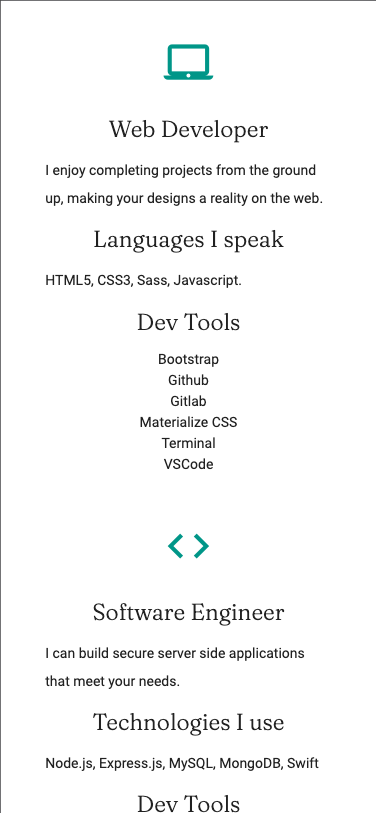
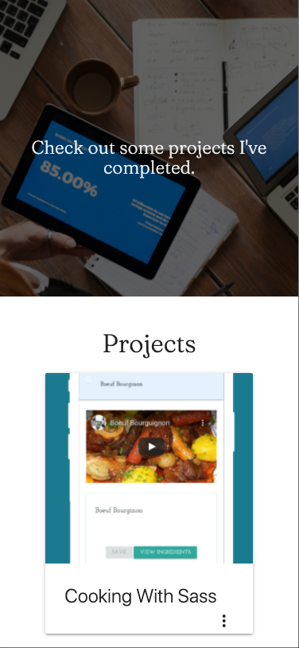
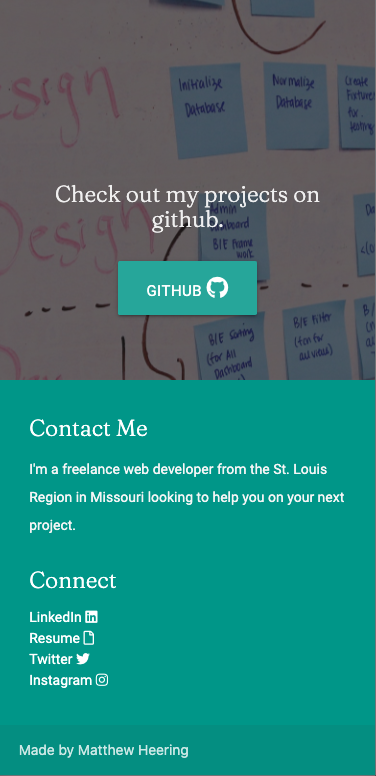

# Matthew_Heering_Portfolio_Website
This repo is for my online portfolio showcasing some projects I have worked on.  

<h4>Access the portfolio <a href="https://mcheering.github.io/Matthew_Heering_Portfolio_Website/">here</h4>

<h5>Description</h5>

This website is an online portfolio that gives a breif description of who I am, my skills, and showcases some projects I have worked on.  It also provides contact information.

<h6>Landing</h6>

When you land on my site, you will see this,</p;>
"style="width: 300px">

You can scroll, press the hamburger icon on the top left, or swipe from left to right to open a menu and use the quicklinks that take you to specific sections of the page. 

<h6>About</h6>

This section gives some background about my skills, and what I can offer to a scrum team 

<h6>Projects</h6>

This section showcases 3 projects I have worked on.  There is a thumbnail that shows the application, and you can press the 3 dots and a description will be revealed with a link to the deployed application

<h6>Contact</h6>

This section provides methods of how you can get in contact with me.  It also provides a download link to my resume, and a link to my github page so you can go look at my projects in more detail. 

